# ⚡ Welcome to my Digital Space! I'm Hardik Abrol

<p align="center">
  
</p>

<p align="center">
  
</p>

## 🔮 About Me

```yaml
identity:
  name: Hardik Abrol
  role: Computer Engineering Student (Class of 2027) & Web Developer Intern @ GSTech (AdSpyder)
  institution: Thapar Institute of Engineering and Technology
  focus: Machine Learning, Deep Learning, GenAI, Full-Stack Development, & DSA

status:
  current_pursuits:
    - Web Developer Intern at GSTech Technology Pvt Ltd (AdSpyder)
    - Building full-stack apps with React, Next.js, FastAPI, Flask & Streamlit
    - Solving Data Structures & Algorithms (DSA) problems in C++ & Python
    - Deep Learning & Generative AI practitioner (NVIDIA, DeepLearning.AI & AWS certified)
    - Orchestrating LLM agents & optimizing RAG pipelines
    - Building robust, explainable ML models with scikit-learn, CatBoost & SHAP
```

I like taking a project end-to-end — from a rough idea, to a trained model or a working API, to something deployed and actually usable. Outside of coursework and my internship, that habit shows up as a handful of shipped side projects (see below) rather than just tutorials.

<p align="center">
  
</p>

<p align="center">
  
</p>

## 🚀 Tech Radar

### 💻 Core Languages
<a href="https://python.org" target="_blank"></a>
<a href="https://www.typescriptlang.org" target="_blank"></a>
<a href="https://developer.mozilla.org/en-US/docs/Web/JavaScript" target="_blank"></a>
<a href="https://en.wikipedia.org/wiki/C%2B%2B" target="_blank"></a>
<a href="https://developer.mozilla.org/en-US/docs/Web/HTML" target="_blank"></a>
<a href="https://developer.mozilla.org/en-US/docs/Web/CSS" target="_blank"></a>

### 🎨 Frontend & UI
<a href="https://react.dev" target="_blank"></a>
<a href="https://nextjs.org" target="_blank"></a>
<a href="https://vite.dev" target="_blank"></a>
<a href="https://tailwindcss.com" target="_blank"></a>
<a href="https://www.framer.com/motion/" target="_blank"></a>
<a href="https://gsap.com" target="_blank"></a>

### 🧠 AI / ML Engine Room
<a href="https://jupyter.org" target="_blank"></a>
<a href="https://scikit-learn.org" target="_blank"></a>
<a href="https://pandas.pydata.org" target="_blank"></a>
<a href="https://numpy.org" target="_blank"></a>
<a href="https://catboost.ai" target="_blank"></a>
<a href="https://matplotlib.org" target="_blank"></a>
<a href="https://plotly.com" target="_blank"></a>
<a href="https://huggingface.co" target="_blank"></a>
<a href="https://langchain.com" target="_blank"></a>

### 🛠️ Backend, Databases & Tools
<a href="https://fastapi.tiangolo.com" target="_blank"></a>
<a href="https://flask.palletsprojects.com" target="_blank"></a>
<a href="https://streamlit.io" target="_blank"></a>
<a href="https://www.mysql.com" target="_blank"></a>
<a href="https://www.sqlite.org" target="_blank"></a>
<a href="https://www.sqlalchemy.org" target="_blank"></a>
<a href="https://www.docker.com" target="_blank"></a>
<a href="https://vercel.com" target="_blank"></a>
<a href="https://developer.chrome.com/docs/extensions" target="_blank"></a>

<p align="center">
  
</p>

## 🌟 Featured Projects

<table>
  <tr>
    <td width="100%">
      <h3><a href="https://github.com/Hardikabrol8/Athlyt" target="_blank">🏋️ Athlyt</a></h3>
      <p><b>AI-powered fitness coaching platform</b> — personalised workout plans, nutrition tracking, progress analytics, and session management. My flagship full-stack + ML build, complete with 220 passing backend tests and CI on every push.</p>
      <p>
        <code>Next.js 15</code> · <code>TypeScript</code> · <code>FastAPI</code> · <code>SQLAlchemy</code> · <code>scikit-learn</code>
      </p>
      <a href="https://athlyt-taupe.vercel.app" target="_blank"></a>
      <a href="https://athlyt-backend.onrender.com/docs" target="_blank"></a>
      <a href="https://github.com/Hardikabrol8/Athlyt/actions/workflows/backend-ci.yml" target="_blank"></a>
    </td>
  </tr>
</table>

<table>
  <tr>
    <td width="50%" valign="top">
      <h3><a href="https://github.com/Hardikabrol8/Mental_Health_Predictor" target="_blank">🧠 Mental Health Predictor</a></h3>
      <p>An interactive Streamlit ML dashboard that predicts mental health risk from lifestyle and survey data.</p>
      <a href="https://mentalhealthpredictor07.streamlit.app" target="_blank"></a>
    </td>
    <td width="50%" valign="top">
      <h3><a href="https://github.com/Hardikabrol8/HAR_project" target="_blank">🏃 Human Activity Recognition</a></h3>
      <p>Classifies daily human activities (walking, sitting, standing, laying) from smartphone accelerometer & gyroscope time-series data (UCI dataset).</p>
    </td>
  </tr>
  <tr>
    <td width="50%" valign="top">
      <h3><a href="https://github.com/Hardikabrol8/youtube_mashup" target="_blank">🎵 YouTube Song Mashup</a></h3>
      <p>Generates a custom audio mashup from any YouTube artist search — available as both a CLI tool and a responsive web service with real-time progress and email delivery.</p>
    </td>
    <td width="50%" valign="top">
      <h3><a href="https://github.com/Hardikabrol8/pagevault-singlefile-extension" target="_blank">🧩 PageVault</a></h3>
      <p>A Chrome Manifest V3 extension that saves any web page as a single self-contained HTML file, inlining assets via the DOM.</p>
    </td>
  </tr>
  <tr>
    <td width="50%" valign="top">
      <h3><a href="https://github.com/Hardikabrol8/reddit-untranslate-extension" target="_blank">🌍 Reddit Untranslate</a></h3>
      <p>A Chrome extension that strips forced auto-translation parameters from Reddit URLs, restoring the original page language.</p>
    </td>
    <td width="50%"></td>
  </tr>
</table>

<p align="center"><a href="https://github.com/Hardikabrol8?tab=repositories" target="_blank"><i>→ See all repositories</i></a></p>

<p align="center">
  
</p>

## 📊 Git Insights & Analytics

<div align="center">
  <table border="0">
    <tr>
      <td width="50%" align="center">
        
      </td>
      <td width="50%" align="center">
        
      </td>
    </tr>
    <tr>
      <td colspan="2" align="center">
        <br />
        
      </td>
    </tr>
  </table>
</div>

## 🐍 Contribution Snake

<p align="center">
  <picture>
    <source media="(prefers-color-scheme: dark)" srcset="https://raw.githubusercontent.com/Hardikabrol8/Hardikabrol8/output/github-contribution-grid-snake-dark.svg" />
    <source media="(prefers-color-scheme: light)" srcset="https://raw.githubusercontent.com/Hardikabrol8/Hardikabrol8/output/github-contribution-grid-snake.svg" />
    
  </picture>
</p>

<p align="center">
  
</p>

## ⚡ Connect with Me

<p align="center">
  <a href="https://hardik-abrol-portfolio.vercel.app" target="_blank"></a>
  <a href="https://www.linkedin.com/in/hardik-abrol" target="_blank"></a>
  <a href="mailto:hardikabrol8@gmail.com" target="_blank"></a>
  <a href="https://github.com/Hardikabrol8" target="_blank"></a>
</p>

<br />

<p align="center">
  <i>"The best way to predict the future is to invent it."</i>
</p>

<p align="center">
  
</p>

<p align="center">
  <b>Thanks for visiting! Let's build something amazing together 🚀</b>
</p>
